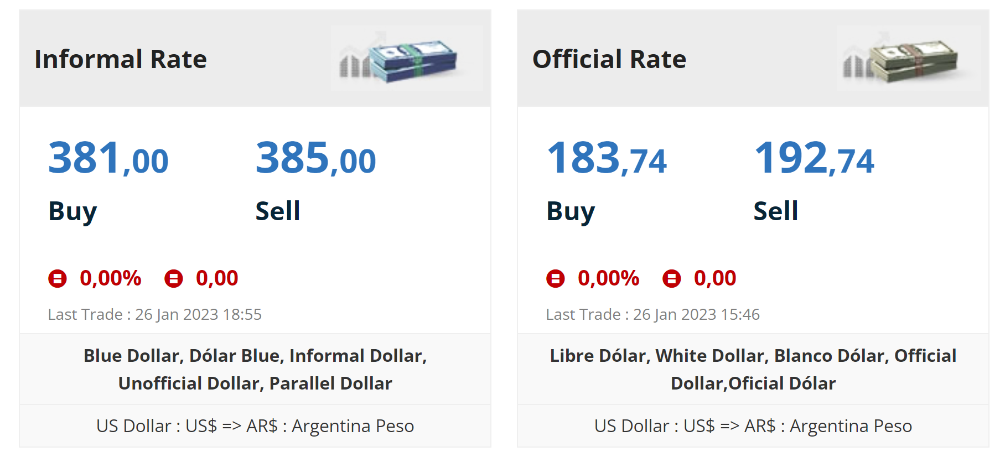
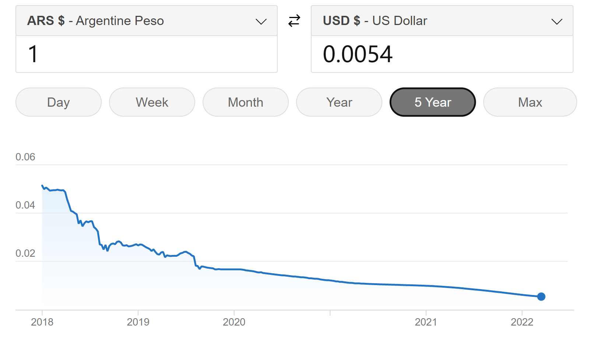
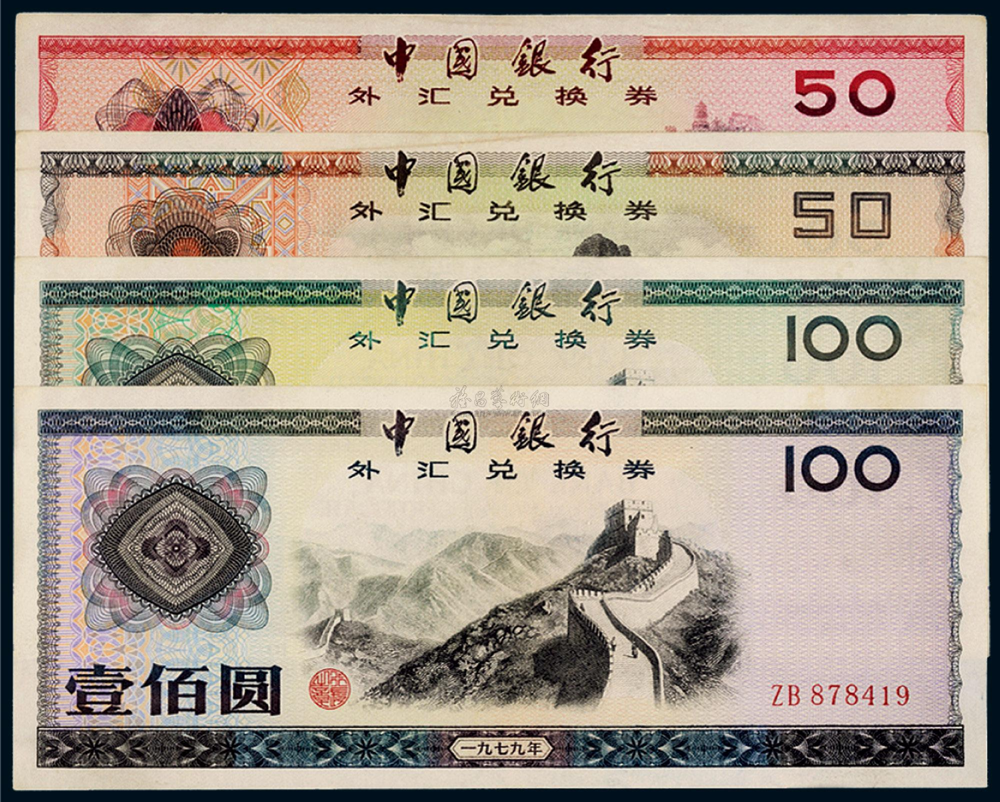
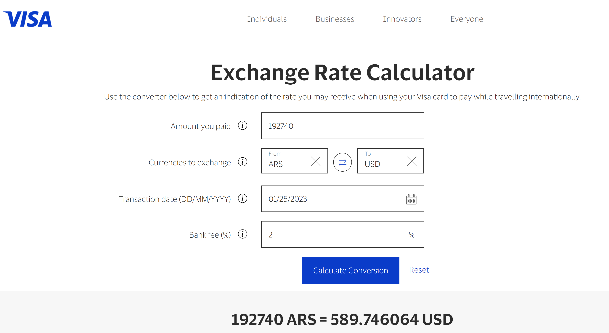
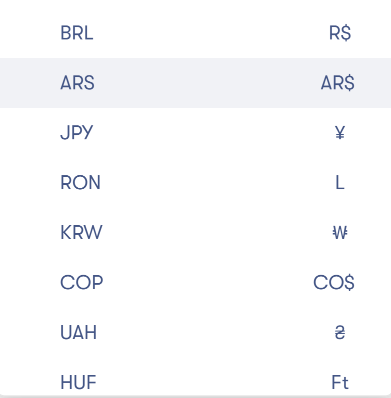
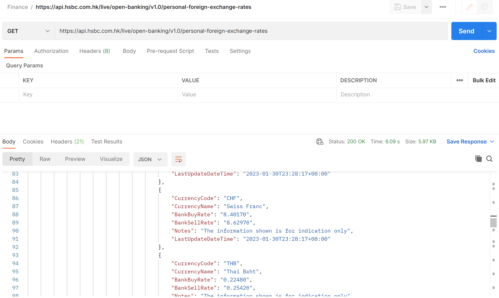
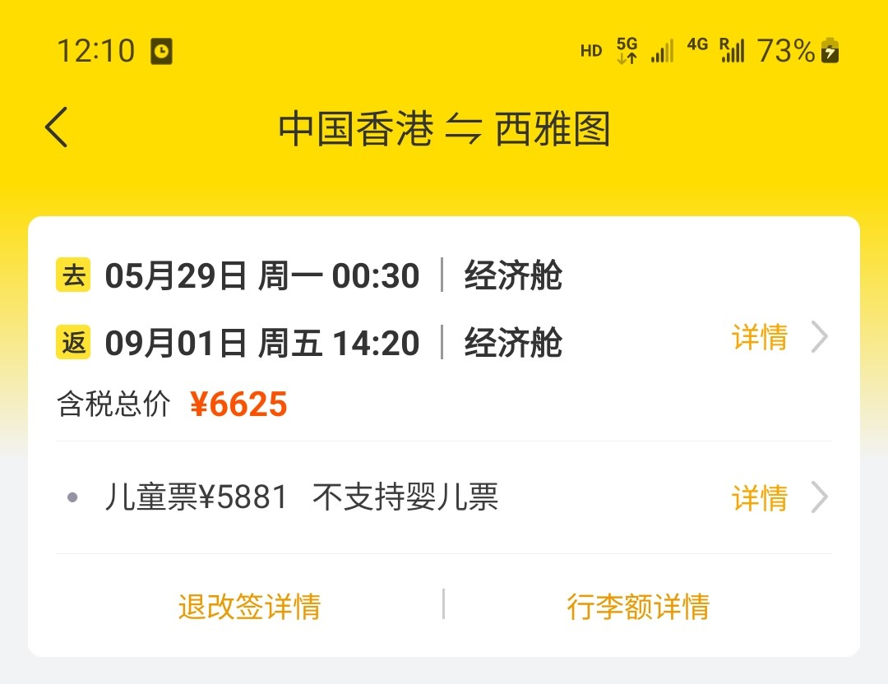
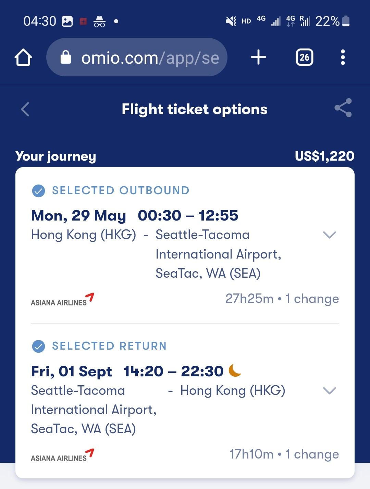
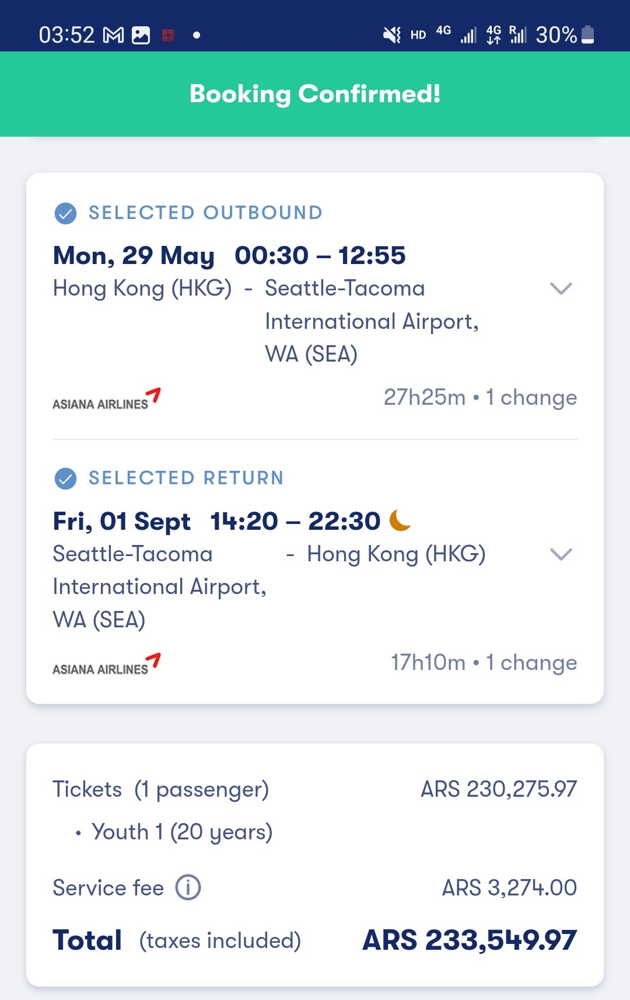
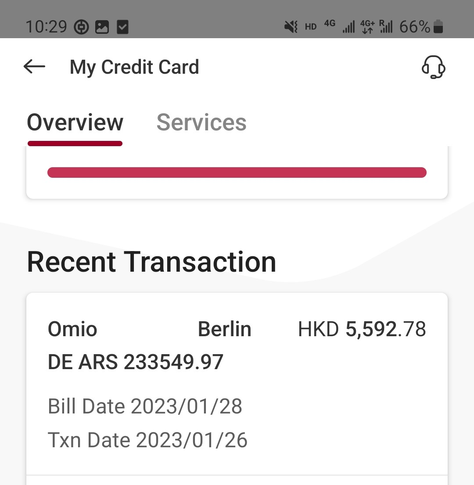

# 阿根廷比索汇率漏洞分析

初五迎财神，准备睡觉的时候，看到美卡指南的推送[疯狂的“阿根廷央行百亿补贴” — 利用 Visa/Mastercard 阿根廷汇率漏洞 实现六折消费！](https://www.uscreditcardguide.com/fengkuangdeagentingyangxingbaiyibutie-liyong-visa-mastercard-agentinghuishuailoudong-shixianba/)，直接冲了。因为上车已经太晚了，很多大额通道（例如[Flywire](https://www.flywire.com/)和[PayPal](https://paypal.com/)）已经堵死，没实现财富自由，只是小赚2kRMB不到。早发现这个漏洞的人直接`ARS`交学费/房租，真的爽到飞起。

本人之前有用[Stripe](https://stripe.com/en-gb-hk)的API搭网店和实体店收银系统的经历，感觉这事还挺有意思的，写下来记录下本次薅羊毛的经历。同时，也提醒各位想自己搞网店/开发线上支付的朋友注意相关风险。

## 免责声明

本文仅用于学习讨论，因尝试文中内容而造成的任何损失与后果，作者概不负责。

注：本文中的“境外”，“外国”指阿根廷外的其它国家或地区。

## 事件简介

阿根廷比索（`ARS$`）采用**双轨货币制**。简要来说，阿根廷政府维持一个`USD-ARS`的浮动汇率（**公价**，Official Rate），用于官方出口。而在其它方面，汇率则由市场自由决定（**黑市价**，Informal Rate）。在阿根廷，黑市价与公价的价差高达一倍：

（数据来源：[Bluedollar](https://bluedollar.net/))

先前，阿根廷政府要求**国际信用卡组织**（Visa，Mastercard，Discover，美国运通）均使用公价进行结算。2022年12月，阿官方基于“振兴旅游业”的原因，宣布将允许卡组织直接使用黑市价进行结算，也就是说，对于以阿根廷比索定价的出口商品，外国游客在换算成美元之后，**仅需支付原先60%左右的价格**。Visa与Discover两家机构**最早完成“汇率换轨”**。

然而，由于部分支持阿根廷比索的外国企业事先未对“**汇率换轨**”做好准备，大量**以外币计价**的商品或服务，也可以通过在付款页面选择`Official ARS`的方式，以六折购买。以下是部分[美卡论坛](https://www.uscardforum.com/t/topic/132382)上公开的存在此漏洞的企业：

- 卡塔尔航空
- 土耳其航空
- PayPal（自己给自己转账，付款币种选择`ARS`，收款币种选择`USD`，然而由于风控，无法走大额）
- Omio（德国一家旅行OTA，类似携程，本人就薅的是这家）
- Flywire（收取一定手续费，允许客户以信用卡`ARS`支付外币学费/租金/水电网费账单，**适用范围最广**，可用商户包括加州大学伯克利分校，香港城市大学，纽约大学等等。大部分搞出**几万甚至十几万**的人就用的是这个通道）

截止27/01/2022，大部分上述通道的漏洞已经被修复。但由于所涉及的商户大都为国际大公司，且主要从事机票，缴费，电子转账等**单价高，可囤积，易套现**的业务，我相信，这次的“狂欢”一定很难收场。

## 双轨制汇率

当政府施行浮动汇率政策时，如民间非正式市场（黑市）对该国货币的定价过高或过低，并且差别异常的大，双轨汇率便产生。朝鲜，古巴，阿根廷，以及九十年代前的中国，均存在这种现象。我不太懂经济学，猜想导致`公价`和`黑市价`差别过大，有以下几种原因：

- 该国实行严格的**外汇管制政策**，因此本国居民及企业无法轻易通过官方渠道获得外汇，只得溢价在黑市上交易。
- 国内存在**恶性通货膨胀**，居民及企业迫切需要外汇实现资产保值。

（`Official ARS`兑`USD`走势，数据来源：[Refinitiv](https://www.refinitiv.com/en))

- 在国内使用外汇，可以享受一些**非货币的好处**（例如平壤的进口超市只接受美元，欧元，以及人民币付款；九十年代之前我国的[友谊商店](https://baike.baidu.com/item/%E5%8F%8B%E8%B0%8A%E5%95%86%E5%BA%97/5235874)仅支持凭[外汇兑换券](https://baike.baidu.com/item/%E5%A4%96%E6%B1%87%E5%88%B8/639104)购物）。

（中国外汇兑换券)

- 最重要的是，这种价差无法通过**套利**缩小（套利的例子：胆子大的外国游客为了省钱，携带大量`USD`入境阿根廷，找黄牛以`黑市价`换成`ARS`，然后再凭游客身份从官方处以较低的`公价`兑回`USD`，长久以往，`黑市价`就会向`公价`靠近）。

如果不是阿根廷存在双轨汇率，这次的**全场六折**活动也不会拉开帷幕。

## 实际原理

虽说双轨汇率给这次party埋下了种子，但真正引发巨大损失的原因是**Visa/Discover已经使用`黑市价`，而商户系统还在参考`公价`**

举个例子：

卡塔尔航空一张机票，定价`1000USD`，官网选择`ARS`货币选项，按公价汇率，屏幕显示折成`ARS`需支付`192,740ARS`

小A使用一张美元记账的Visa信用卡（可以是美国发行的卡片，也可以是其它国家/地区发行的美元单币卡）按报价付款`192,740ARS`

Visa按照其[执行牌价](https://www.visa.co.uk/support/consumer/travel-support/exchange-rate-calculator.html)（此时已是`黑市价`）进行兑换，假定发卡行的外币转换费是`2%`，最终有`589.75USD`计入小A账户

最终，小A仅需向发卡行还款`589.75USD`即可，美滋滋

既然小A赚了钱，那肯定要问一个问题：**赚的是谁的钱？**

首先，阿根廷央行不可能输钱。整件事情中，其仅仅是出台了一个政策（允许国际卡组织参考`黑市价`），并不涉及任何实际交易和资金流动。

`Visa/Discover`（两家已经确认完成汇率切换的卡组织）也不可能输钱。因为他们仅仅负责连结发卡行和收单行（商户的收款银行），建立跨境交易网络，并不使用自有资金参与交易。

真正“出血”的，是提供`ARS`报价且未及时更新的商户。最终Visa/Discover向收单行解付的金额，也只有`589.75`USD，还要再减去手续费。

对于小微企业来说，这样的漏洞是致命的，出单量越大损失越大，且很难察觉。甚至有可能要等到月底**收到收单行的结单**时，才知道已经要准备关门大吉了。

## 一些思考

### 这是谁的过错？

很显然，商户未注意到阿根廷央行及Visa/Discover的政策变动，未及时更新自己的系统（把`ARS`汇率调用的**API**更改成`黑市价`的）。不过令人惊讶的是，居然像Flywire，PayPal，卡塔尔航空这种，拥有**庞大账务及技术团队**的国际大企业，都在这里栽了跟头。

（看新闻果然是个好习惯）

正确的做法是，在得知`ARS`的**结算支付政策**可能出现重大变化时，第一时间与卡组织和收单行取得联系，确定具体实施办法。在卡组织切换汇率时，内部系统同步操作，或者保险起见，短期内直接暂停`ARS`支付功能。

电商网站支持多币种支付，直接显示客人当地的价格，是件很好的事情。客人可以一目了然，无需再换算，也不用像发卡行支付额外的外币转换费。通常，商户通过调用银行API，获得银行卖出价，在其基础上上浮，作为内部汇率（可以赚一点小小的差价）。

（Omio网站选择支付货币的菜单）

([香港汇丰提供的汇率接口](https://developer.hsbc.com.hk/))

不过，支持的货币种类也不是越多越好。应尽量选择**安全，稳定，且有较准确数据源的货币**，例如美元，英镑，欧元，港元，人民币等。如果确实需要支持风险较大的货币，应谨慎选择调用的API，并保持关注**该货币及该国金融资讯**，防止突发变动，使内部汇率不再准确。

与此同时，阿根廷央行在发布相关指导政策时，未能有效通知相关持份者，做好解释说明。Visa/Discover更是在缺少与下游支付处理商（Payment Processor）及商户沟通的情况下，擅自调整汇率轨道，根本没有考虑到提供`ARS`转换的境外商户。

因此，这场狂欢是由于某一方出现Bug导致的说法，并不够准确。大家应该反思的是，存在70余年的国际信用卡支付体系，**真的有那么坚不可摧吗？**

最后这笔损失的账款到底由谁来承担，之后会不会出现一些鸡飞狗跳的事情，我们一起拭目以待。

### 利用这个漏洞搞钱会不会有后果？

当外国购物网站直接显示出`ARS`报价时，即意味着消费者**支付货款的义务用`ARS`履行**。商户向支付处理商提交的交易请求（签购单）也以`ARS`计价。至于商户实际上收到多少转换后的本币，不属于消费者责任。因此，使用该汇率漏洞购物，没有理由担心事后被要求补差价，或者面临法律风险。

至于使用PayPal自己转账给自己的这种行为（不属于正常的购物），则需另外讨论。

## 实战操作

今年暑期有北美的出行刚需，打算出一套`HKG-SEA`的往返票。在飞猪上查到韩亚航空`HKG-ICN-SEA`的路线，最低价`6625CNY`（含税）：

Omio网站查到同航班售价`1220USD`，选择`ARS`转换后，需付`233549.97ARS`（含税）：

使用中银香港Visa港元卡支付，实际仅仅扣款`5592.78HKD`

只可惜，Omio平台并不售卖头等/商务舱位机票，因此能薅到的钱有限。

## 后续

1月28日，Visa调整结算汇率，`USD-ARS`再次采用`公价`汇率，即`1USD≈190ARS`，`ARS-USD`则单方向维持`黑市价`。换言之，通过使用Visa卡以`ARS`**在任何外国网站消费，已无法节省实际记账金额**。而阿根廷居民持`ARS`信用卡于外国网站消费，**则需多还款60%的`ARS`**（外国游客捞不到好处，反而把本国居民使劲坑了一把）。

## 参考链接

[Argentina Doubles Peso Dollar Rate for Tourists](https://www.bloomberg.com/news/articles/2022-12-21/argentina-doubles-peso-ars-dollar-usd-rate-for-tourists)

[【百亿补贴】Visa 爆發阿根廷匯率漏洞](https://www.uscardforum.com/t/topic/132382)

[Blue Dollar](https://bluedollar.net/)

[疯狂的“阿根廷央行百亿补贴” — 利用 Visa/Mastercard 阿根廷汇率漏洞 实现六折消费！](https://www.uscreditcardguide.com/fengkuangdeagentingyangxingbaiyibutie-liyong-visa-mastercard-agentinghuishuailoudong-shixianba)

[Visa Wechselkurs ARS zu €](https://www.mydealz.de/deals/xbox-series-x-ca-360eur-durch-guthaben-50eur-psn-ca-33eur-uvm-visa-kreditkarte-erforderlich-wechselkurs-ars-zu-eur-2117879)

[外汇券是啥？！了解曾经万能的外汇券...](https://zhuanlan.zhihu.com/p/87222382)